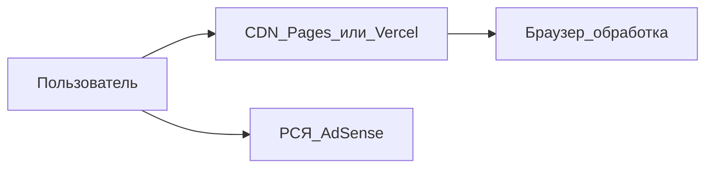

# 07. Экономика, сайзинг и домены — только без бэкенда

Дата: сентябрь 2026. Бренд: **ПиксЛокал**. Продукт: [`web/`](../web/).

## Жёсткое ограничение

**Бэкенда нет и не планируется** в рамках этой стратегии:

- нет VPS / собственной VM;
- нет API загрузки файлов;
- нет БД и серверной обработки изображений;
- нет S3 для пользовательских файлов.

USP «файлы не уходят на сервер» обязателен. Инфраструктура = **CDN/static hosting + один домен**.

---

## 1. Сайзинг облака (0 собственного сервера)

| Ресурс | Значение |
|---|---|
| vCPU | 0 |
| RAM | 0 |
| Диск приложения | 0 (билд на Pages/Vercel) |
| Канал под юзер-фото | нет (обработка в браузере) |

### Этап A — старт (0–20k визитов/мес)

| Компонент | Выбор | Стоимость |
|---|---|---|
| Хостинг | Cloudflare Pages **или** Vercel Hobby | **0 ₽** |
| DNS | Cloudflare Free | **0 ₽** |
| Домен | один `.ru` | **~200–900 ₽/год** |
| Почта | Cloudflare Email Routing → личный ящик / Yandex 360 | **0–~200 ₽/мес** |
| Аналитика | Метрика + GA4 | **0 ₽** |

**Итого год 1 типично: ≈ 500–1500 ₽** (почти только домен).

### Этап B — рост (20–200k+ визитов/мес)

Без VPS. Если free упёрся в bandwidth / лимиты билдов:

- Cloudflare Pro (~$20/мес) **или**
- Vercel Pro (~$20/мес)

Это **единственный** заложенный апгрейд инфраструктуры.

### Трафик vs CDN

| Визиты/мес | Исходящий трафик статики (грубо) | Действие |
|---:|---|---|
| 5k | ~5–20 ГБ | free |
| 50k | ~50–200 ГБ | free, смотреть квоты |
| 200k | ~200–800 ГБ | при лимитах → Pro |
| 1M+ | смотреть Pro / тариф CDN | всё ещё без бэкенда |

---

## 2. Экономика

Формула: `доход/мес ≈ визиты × RPM / 1000`  
RPM ориентир после модерации рекламы: **50–150 ₽** (не гарантия).

| Визиты/мес | RPM 50 ₽ | RPM 100 ₽ | RPM 150 ₽ |
|---:|---:|---:|---:|
| 10k | 500 ₽ | 1 000 ₽ | 1 500 ₽ |
| 50k | 2 500 ₽ | 5 000 ₽ | 7 500 ₽ |
| 200k | 10 000 ₽ | 20 000 ₽ | 30 000 ₽ |

- Себестоимость визита на этапе A ≈ **0 ₽** (кроме комиссии сети/налога).
- Окупаемость домена — при первых тысячах визитов с рекламой.
- Заметный доход — при устойчивых десятках тысяч визитов (месяцы SEO, не дни).
- Pro CDN покупать **по факту** лимитов или уже имеющейся выручки — не заранее.

---

## 3. Стратегия домена

### Правила

1. **Один** брендовый домен — не сетка exact-match.
2. Зона: **`.ru`** в приоритете; запас `.com` / `.online`, если имя занято.
3. Не держать параллельно `.ru` + `.com` с одним контентом без 301.
4. Кластер запросов — **путями** на сайте (`/heic-v-jpg`, `/szhat-jpg`, …).
5. Не брать spam-имена вида `besplatno-szhat-foto-online.ru`.

### Критерии проверки перед покупкой

| Шаг | Что сделать |
|---|---|
| 1 | WHOIS / проверка у REG.RU, Timeweb или Beget — свободен ли домен |
| 2 | DNS: нет «чужих» NS/A (см. пробу ниже) |
| 3 | [Wayback Machine](https://web.archive.org) — нет токсичной истории |
| 4 | Поиск по имени + «отзывы» / товарные знаки |
| 5 | Соцсети / Telegram: свободен ли @ник |
| 6 | Цена регистрации и продления `.ru` на 1 год |

### Shortlist имён (латиница под «ПиксЛокал»)

**Выбран и куплен (сен 2026): [`pixlocal.ru`](https://pixlocal.ru)** — 1 год.  
На момент покупки DNS стояли `statuspage1.nic.ru` / `statuspage2.nic.ru` (заглушка регистратора). **Следующий шаг:** NS → Cloudflare, деплой на Vercel — см. [08-launch-playbook.md](08-launch-playbook.md).

Архив кандидатов ([domain_dns_probe.json](domain_dns_probe.json)):

| Домен | Статус |
|---|---|
| **pixlocal.ru** | **наш, зарегистрирован** |
| localpix.ru, pixlok.ru, lokpix.ru, … | не покупаем |
| pixli.ru, pixcraft.ru | заняты (DNS) |

После покупки: `NEXT_PUBLIC_SITE_URL=https://pixlocal.ru`, контакты `hello@pixlocal.ru`.

---

## 4. Деплой static/edge (без серверных фич)

### Разрешено

- Статический / edge-рендер страниц Next.js на **Cloudflare Pages** или **Vercel**
- Клиентский JS: canvas, heic2any, JSZip
- Переменные только `NEXT_PUBLIC_*` (URL, аналитика, флаги рекламы)
- CDN-кэш HTML/JS/CSS

### Запрещено (ломает стратегию)

- Route Handlers / API Routes для приёма файлов
- Server Actions, пишущие файлы или вызывающие тяжёлую обработку картинок на сервере
- Подключение БД, Redis, S3 под пользовательский контент
- Аренда VPS «чтобы было куда деплоить»
- `output: 'standalone'` + свой Node на VM — не нужен для этой модели

### Практические варианты деплоя

**Вариант 1 — Vercel (проще для Next as-is)**

1. Импорт репозитория / папки `web`
2. Root Directory: `web`
3. Env: `NEXT_PUBLIC_SITE_URL=https://ваш-домен.ru`
4. Custom domain → DNS у Cloudflare (CNAME/A по инструкции Vercel)

**Вариант 2 — Cloudflare Pages**

1. Сборка из `web` (фреймворк Next.js; при необходимости — адаптер/@cloudflare или OpenNext по актуальной доке CF на момент деплоя)
2. Тот же env `NEXT_PUBLIC_SITE_URL`
3. Custom domain в проекте Pages

Пока нет аккаунта CF/Vercel — локально достаточно `npm run build && npm run start` только для проверки; прод = Pages/Vercel.

Реклама и Метрика: см. [05-monetize.md](05-monetize.md), [06-iterate.md](06-iterate.md). Флаг `NEXT_PUBLIC_ADS_ENABLED=false` до модерации.

---

## 5. Чеклист запуска (без аренды VM)

### Домен и DNS

- [ ] Выбрать имя из shortlist, подтвердить свободу у регистратора
- [ ] Купить **один** `.ru` на 1 год
- [ ] Создать аккаунт Cloudflare, делегировать NS
- [ ] Не покупать второй домен и не арендовать VPS

### Хостинг

- [ ] Создать проект Cloudflare Pages **или** Vercel
- [ ] Root = `web`, успешный production-deploy
- [ ] Подключить кастомный домен + HTTPS
- [ ] `NEXT_PUBLIC_SITE_URL=https://<домен>`
- [ ] Проверить canonical / sitemap: `https://<домен>/sitemap.xml`

### Почта и юр. страницы

- [ ] Cloudflare Email Routing: `hello@<домен>` → ваш ящик
- [ ] Обновить email на странице `/contacts`
- [ ] Перечитать `/privacy` и `/terms` под реальный домен

### Поиск и аналитика

- [ ] Яндекс.Вебмастер — добавить сайт, sitemap
- [ ] Google Search Console — то же
- [ ] Яндекс.Метрика + (по желанию) GA4 → ID в env
- [ ] Мониторинг «Алиса AI» в Вебмастере (после индексации)

### Монетизация (позже)

- [ ] Стабильный трафик и нормальное поведение
- [ ] Заявка РСЯ / AdSense
- [ ] Прописать ID блоков, `NEXT_PUBLIC_ADS_ENABLED=true`
- [ ] Не перекрывать dropzone рекламой

### Когда повышать бюджет

- [ ] Free режет bandwidth/билды → Pro CDN (~$20/мес)
- [ ] Иначе — не повышать

---

## Итог одной строкой

**0 собственного сервера + CDN free + 1× `.ru` ≈ 1–2 тыс. ₽/год** до Pro; бэкенд и VPS вне стратегии.
