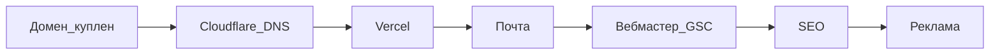

# 08. Пошаговый план запуска ПиксЛокал

Домен: **pixlocal.ru** (куплен, 1 год).  
Стек: Next.js в [`web/`](../web/), **без бэкенда и без VPS**.  
Подробнее по деньгам: [07-economics-and-domains.md](07-economics-and-domains.md).

---

## Фаза 0 — домен (сделано)

- [x] Куплен **pixlocal.ru** на 1 год
- [x] SSL GlobalSign у регистратора **не** покупали (HTTPS даст Vercel/Cloudflare)
- [ ] Сменить DNS с заглушки nic.ru на Cloudflare (сейчас стоят `statuspage1.nic.ru` / `statuspage2.nic.ru` — это временная страница регистратора, не сайт)

**Что сделать в кабинете NIC.RU / REG.RU:**

1. Зарегистрироваться на [Cloudflare](https://dash.cloudflare.com) → Add site → `pixlocal.ru` (тариф Free).
2. Cloudflare покажет два NS вида `*.ns.cloudflare.com`.
3. В панели домена заменить DNS-серверы с `statuspage1/2.nic.ru` на NS от Cloudflare.
4. Дождаться «Active» в Cloudflare (часто от минут до суток).
5. Отдельный платный SSL у регистратора не нужен.

---

## Фаза 1 — деплой сайта

- [ ] Аккаунт [Vercel](https://vercel.com) (рекомендуемый путь для Next.js)
- [ ] Импорт репозитория / загрузка проекта, **Root Directory = `web`**
- [ ] Environment Variable: `NEXT_PUBLIC_SITE_URL=https://pixlocal.ru`
- [ ] Production Deploy успешен
- [ ] Project → Domains → добавить `pixlocal.ru` и `www.pixlocal.ru` (www → redirect на apex)
- [ ] В Cloudflare DNS: записи по подсказке Vercel (обычно CNAME/`A` на Vercel; прокси Cloudflare можно оставить DNS-only серым облаком на старте или orange — оба варианта ок при корректных записях)
- [ ] Открыть `https://pixlocal.ru` — сайт ПиксЛокал, не statuspage nic.ru
- [ ] Проверить `https://pixlocal.ru/sitemap.xml` и `/heic-v-jpg`

**Запрещено:** аренда VPS, API загрузки файлов, свой GlobalSign «вместо» CDN.

Альтернатива: Cloudflare Pages вместо Vercel — см. [07 §4](07-economics-and-domains.md).

---

## Фаза 2 — почта и юридические страницы

- [ ] Cloudflare → Email Routing: `hello@pixlocal.ru` → ваш личный ящик
- [ ] На сайте контакты уже `hello@pixlocal.ru` ([`/contacts`](../web/src/app/contacts/page.tsx))
- [ ] Написать тестовое письмо на `hello@…` и убедиться, что доходит
- [ ] Перечитать `/privacy` и `/terms` под боевой домен

---

## Фаза 3 — день 0: поиск и аналитика

- [ ] [Яндекс.Вебмастер](https://webmaster.yandex.ru) — добавить `https://pixlocal.ru`, подтвердить, отправить sitemap
- [ ] [Google Search Console](https://search.google.com/search-console) — то же
- [ ] Создать счётчик [Метрики](https://metrika.yandex.ru); цели: выбор файлов / скачивание / ZIP (по событиям позже)
- [ ] По желанию GA4
- [ ] В Vercel env: `NEXT_PUBLIC_YM_ID=…`, при необходимости `NEXT_PUBLIC_GA4_ID=…` → Redeploy
- [ ] `NEXT_PUBLIC_ADS_ENABLED` оставить `false`

---

## Фаза 4 — недели 1–2

- [ ] Все ключевые URL в индексе / «ожидают» без ошибок обхода
- [ ] Smoke: сжать JPG, HEIC→JPG, ZIP на мобильном
- [ ] Вебвизор: где бросают dropzone
- [ ] Сверка ядра в Wordstat (вручную) — [NICHE_DECISION.md](NICHE_DECISION.md)
- [ ] Отчёт «Алиса AI» в Вебмастере — только мониторинг

Детали: [06-iterate.md](06-iterate.md).

---

## Фаза 5 — месяцы 1–2

- [ ] Новые посадочные только под запросы из GSC / Метрики
- [ ] Улучшения UX по факту поведения
- [ ] Аккуратные упоминания (без спам-ссылок)

---

## Фаза 6 — реклама (не раньше стабильного трафика)

- [ ] Заявка в РСЯ и/или AdSense
- [ ] Прописать ID блоков в env
- [ ] `NEXT_PUBLIC_ADS_ENABLED=true` → Redeploy
- [ ] Блоки не перекрывают инструмент

Детали: [05-monetize.md](05-monetize.md).

---

## Фаза 7 — апгрейд инфраструктуры

- [ ] Free Vercel/Cloudflare хватает → ничего не покупать
- [ ] Упёрлись в лимиты → Pro CDN (~$20/мес), **не** VPS

---

## Готово к публичному запуску, если

1. `https://pixlocal.ru` открывает ПиксЛокал (не statuspage).  
2. HTTPS зелёный без ручного GlobalSign.  
3. Sitemap в Вебмастере/GSC.  
4. Работает `hello@pixlocal.ru`.  
5. Реклама ещё выключена.

**Следующий ваш шаг прямо сейчас:** фаза 0 — заменить NS `statuspage*.nic.ru` на Cloudflare, затем фаза 1 — Vercel.
