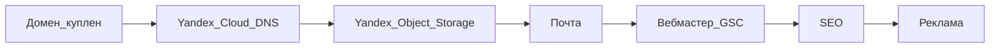

# 08. Пошаговый план запуска ПиксЛокал

Домен: **pixlocal.ru** (куплен, 1 год).  
Стек: Next.js в [`web/`](../web/), **без бэкенда и без VPS**. Origin: **Yandex Object Storage**.  
Подробнее по деньгам: [07-economics-and-domains.md](07-economics-and-domains.md).



---

## Фаза 0 — домен (сделано)

- [x] Куплен **pixlocal.ru** на 1 год
- [x] SSL GlobalSign у регистратора **не** покупали (HTTPS даёт Certificate Manager / Let's Encrypt на бакете)
- [ ] Сайт открывается на `https://pixlocal.ru` **с Android без VPN** (мобильный интернет)

Старый origin на Vercel / Cloudflare Pages с телефона в РФ без VPN обычно не открывается (ТСПУ). Это ожидаемо до переноса в Object Storage.

---

## Фаза 1 — деплой в РФ (сделать вручную + git)

Код уже собирается в статику (`output: 'export'`). Выкладка: [`.github/workflows/deploy.yml`](../.github/workflows/deploy.yml).

**Запрещено:** аренда VPS, API загрузки файлов, оранжевое облако Cloudflare, origin на Vercel.

### 1. Консоль Yandex Cloud

1. Платёжный аккаунт (карта). Free tier Object Storage: 1 ГБ, 100 ГБ исходящего, 100 000 GET/мес — на старте обычно 0 ₽.
2. Сервисный аккаунт с ролью `storage.editor` на каталог. Создать **статический ключ** (Access Key ID + Secret).
3. Бакет с именем **точно** `pixlocal.ru` (точка в имени обязательна для своего домена).
4. Доступ: публичное чтение объектов (политика бакета / «публичный»).
5. Настройки бакета → **Сайт**: режим «Хостинг», главная `index.html`, страница ошибки `404.html`.
6. [Certificate Manager](https://yandex.cloud/ru/docs/certificate-manager/quickstart/): Let's Encrypt на `pixlocal.ru` (и `www.pixlocal.ru`, если будете его использовать). Проверка владения DNS TXT.
7. Бакет → HTTPS: привязать сертификат. Редирект HTTP→HTTPS включится сам.

### 2. DNS в Yandex Cloud (критично)

На NIC.RU домен **делегирован** на `ns1.yandexcloud.net` / `ns2.yandexcloud.net`. Cloudflare больше не участвует.

Зона в Cloud DNS уже есть (SOA serial 1), но **записи A/ANAME нет** — `pixlocal.ru` никуда не резолвится. Сайт при этом жив на `http://pixlocal.ru.website.yandexcloud.net/`.

В [консоли Cloud DNS](https://console.yandex.cloud/) → зона `pixlocal.ru.` → **Создать запись**:

| Имя | Тип | Значение |
|---|---|---|
| `@` (совпадает с зоной) | **ANAME** | `pixlocal.ru.website.yandexcloud.net` |
| `www` (по желанию) | CNAME | `pixlocal.ru.website.yandexcloud.net` |

Через 1–5 минут `http://pixlocal.ru` должен открыться.

Затем бакет → **HTTPS**: Certificate Manager, Let's Encrypt на `pixlocal.ru`. Редирект HTTP→HTTPS включится сам.

Контакт: личная почта `wasp777@mail.ru` на `/contacts` (доменный ящик и MX не настраиваем).

### 3. Ключи и GitHub

Для S3 нужны **статический Access Key ID + Secret**, не IAM `authorized_key.json` напрямую.

`authorized_key.json` (ключ сервисного аккаунта) подходит, чтобы **выпустить** статический ключ. Файл держите локально — он в `.gitignore`, в git не коммитить.

```bash
# один раз: CLI https://yandex.cloud/ru/docs/cli/quickstart
yc config set service-account-key authorized_key.json
yc iam access-key create --service-account-id <service_account_id из JSON>
```

В выводе:

- `key_id` (обычно `YCAJ…`) → секрет GitHub `YC_SA_ACCESS_KEY_ID`
- `secret` (обычно `YCN…`, показывается один раз) → `YC_SA_SECRET_ACCESS_KEY`

Пара «идентификатор `aje…` + ключ `YCAJ…`» без `secret` для заливки **недостаточна**.

Secrets репозитория:

- `YC_SA_ACCESS_KEY_ID`
- `YC_SA_SECRET_ACCESS_KEY`

Variables (по желанию): `NEXT_PUBLIC_YM_ID`, `NEXT_PUBLIC_GA4_ID`, `NEXT_PUBLIC_ADS_ENABLED=false`, verification-токены.

Push в `main` (пути `web/**`) или **Actions → Deploy to Yandex Object Storage → Run workflow**.

Пока секретов нет, Action только собирает сайт и пишет в лог, что заливка пропущена.

Локально после `npm run build`:

```bash
export AWS_ACCESS_KEY_ID=…
export AWS_SECRET_ACCESS_KEY=…
bash web/scripts/sync-yandex-s3.sh
```

### 4. Проверка с Android без VPN

На **мобильном интернете** (не Wi‑Fi, VPN выключен):

- [ ] `https://pixlocal.ru/` — зелёный HTTPS, не таймаут
- [ ] `/heic-v-jpg/` — открывается, можно выбрать файл и скачать
- [ ] `/privacy/`, `https://pixlocal.ru/sitemap.xml`
- [ ] В DNS нет Vercel (`76.76.x.x`); NS — `ns1.yandexcloud.net`

Повторить с домашнего Wi‑Fi. Если снова таймаут — нет ли ANAME на `pixlocal.ru.website.yandexcloud.net`.

После успешного переноса отключить проект на Vercel, чтобы не было двух origin.

---

## Фаза 2 — почта и юридические страницы

- [x] На сайте контакты `wasp777@mail.ru` ([`/contacts`](../web/src/app/contacts/page.tsx))
- [x] `/privacy` упоминает Метрику и события выбора файлов / скачивания / ZIP

---

## Фаза 3 — поиск и аналитика (код готов, кабинеты — вручную)

Код: счётчик в [`Analytics.tsx`](../web/src/components/Analytics.tsx), цели в [`track.ts`](../web/src/lib/track.ts), favicon/OG, verification-мета из env.

Пошагово: [06-iterate.md](06-iterate.md) (день 0).

- [ ] Счётчик [Метрики](https://metrika.yandex.ru), вебвизор + карта кликов
- [ ] Цели JavaScript-событие: `file_select`, `download`, `zip_download`
- [ ] [Яндекс.Вебмастер](https://webmaster.yandex.ru) — подтвердить, sitemap, обход `/`, `/heic-v-jpg/`, `/szhat-jpg/`, `/szhat-do-100kb/`, `/webp-v-jpg/`
- [ ] [Google Search Console](https://search.google.com/search-console) — то же
- [ ] GitHub Variables: `NEXT_PUBLIC_YM_ID=…` (опционально GA4 и verification) → **перезапуск Action**
- [ ] Проверка: Network `mc.yandex.ru`; тестовое сжатие бьёт `download`
- [ ] `NEXT_PUBLIC_ADS_ENABLED` оставить `false`

---

## Фаза 4 — недели 1–2

Чеклист и пятничный ритуал: [06-iterate.md](06-iterate.md).

- [ ] Все ключевые URL в индексе / «ожидают» без ошибок обхода
- [ ] Smoke: сжать JPG, HEIC→JPG, ZIP на мобильном **без VPN**
- [ ] Вебвизор: где бросают dropzone
- [ ] Сверка ядра в Wordstat — [NICHE_DECISION.md](NICHE_DECISION.md)
- [ ] Отчёт «Алиса AI» в Вебмастере — только мониторинг

---

## Фаза 5 — месяцы 1–3 (органика)

- [ ] Пятница 15 мин: индекс, фразы, воронка визит → файл → скачать
- [ ] Новые посадочные только под запросы из GSC / Вебмастера
- [ ] Упоминания без спама: HEIC / 100 КБ / «файлы не уходят на сервер»
- [ ] Не Директ, не каталоги, не блог без CTA

---

## Фаза 6 — реклама (не раньше стабильного трафика)

- [ ] Заявка в РСЯ и/или AdSense
- [ ] Прописать ID блоков в GitHub Variables
- [ ] `NEXT_PUBLIC_ADS_ENABLED=true` → перезапуск Action
- [ ] Блоки не перекрывают инструмент

Детали: [05-monetize.md](05-monetize.md).

---

## Фаза 7 — апгрейд инфраструктуры

- [ ] Free Object Storage хватает → ничего не покупать
- [ ] Упёрлись в GET/трафик → сначала счёт Яндекса; не возвращаться на Vercel

---

## Готово к публичному запуску, если

1. `https://pixlocal.ru` открывает ПиксЛокал с Android без VPN.  
2. HTTPS зелёный (Let's Encrypt на бакете).  
3. Sitemap в Вебмастере/GSC.  
4. На `/contacts` — `wasp777@mail.ru`.  
5. Реклама ещё выключена.

**Следующий ваш шаг прямо сейчас:** ANAME в Cloud DNS + Let's Encrypt на бакете, затем [06-iterate.md](06-iterate.md) — день 0.
