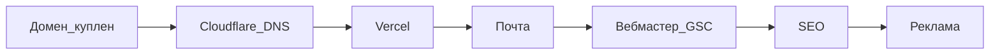

# 08. Пошаговый план запуска ПиксЛокал

Домен: **pixlocal.ru** (куплен, 1 год).  
Стек: Next.js в [`web/`](../web/), **без бэкенда и без VPS**.  
Подробнее по деньгам: [07-economics-and-domains.md](07-economics-and-domains.md).

---

## Фаза 0 — домен (сделано)

- [x] Куплен **pixlocal.ru** на 1 год
- [x] SSL GlobalSign у регистратора **не** покупали (HTTPS даст Vercel/Cloudflare)
- [x] Сайт открывается на `https://pixlocal.ru` (не statuspage nic.ru)

---

## Фаза 1 — деплой сайта

- [x] Сайт в проде: [https://pixlocal.ru](https://pixlocal.ru), sitemap: [https://pixlocal.ru/sitemap.xml](https://pixlocal.ru/sitemap.xml)

**Запрещено:** аренда VPS, API загрузки файлов, свой GlobalSign «вместо» CDN.

---

## Фаза 2 — почта и юридические страницы

- [ ] Cloudflare → Email Routing: `hello@pixlocal.ru` → ваш личный ящик
- [x] На сайте контакты `hello@pixlocal.ru` ([`/contacts`](../web/src/app/contacts/page.tsx))
- [ ] Написать тестовое письмо на `hello@…` и убедиться, что доходит
- [x] `/privacy` упоминает Метрику и события выбора файлов / скачивания / ZIP

---

## Фаза 3 — поиск и аналитика (код готов, кабинеты — вручную)

Код: счётчик в [`Analytics.tsx`](../web/src/components/Analytics.tsx), цели в [`track.ts`](../web/src/lib/track.ts), favicon/OG, verification-мета из env.

Пошагово: [06-iterate.md](06-iterate.md) (день 0).

- [ ] Счётчик [Метрики](https://metrika.yandex.ru), вебвизор + карта кликов
- [ ] Цели JavaScript-событие: `file_select`, `download`, `zip_download`
- [ ] [Яндекс.Вебмастер](https://webmaster.yandex.ru) — подтвердить, sitemap, обход `/`, `/heic-v-jpg`, `/szhat-jpg`, `/szhat-do-100kb`, `/webp-v-jpg`
- [ ] [Google Search Console](https://search.google.com/search-console) — то же
- [ ] Env на хостинге: `NEXT_PUBLIC_YM_ID=…` (опционально `NEXT_PUBLIC_GA4_ID`, `NEXT_PUBLIC_YANDEX_VERIFICATION`, `NEXT_PUBLIC_GOOGLE_SITE_VERIFICATION`) → **Redeploy**
- [ ] Проверка: Network `mc.yandex.ru`; тестовое сжатие бьёт `download`
- [ ] `NEXT_PUBLIC_ADS_ENABLED` оставить `false`

---

## Фаза 4 — недели 1–2

Чеклист и пятничный ритуал: [06-iterate.md](06-iterate.md).

- [ ] Все ключевые URL в индексе / «ожидают» без ошибок обхода
- [ ] Smoke: сжать JPG, HEIC→JPG, ZIP на мобильном
- [ ] Вебвизор: где бросают dropzone
- [ ] Сверка ядра в Wordstat — [NICHE_DECISION.md](NICHE_DECISION.md)
- [ ] Отчёт «Алиса AI» в Вебмастере — только мониторинг

---

## Фаза 5 — месяцы 1–3 (органика)

- [ ] Пятница 15 мин: индекс, фразы, воронка визит → файл → скачать
- [ ] Новые посадочные только под запросы из GSC / Вебмастера
- [ ] Упоминания без спама: HEIC / 100 КБ / «файлы не уходят на сервер»
- [ ] Не Директ, не каталоги, не блог без CTA

---

## Фаза 6 — реклама (не раньше стабильного трафика)

- [ ] Заявка в РСЯ и/или AdSense
- [ ] Прописать ID блоков в env
- [ ] `NEXT_PUBLIC_ADS_ENABLED=true` → Redeploy
- [ ] Блоки не перекрывают инструмент

Детали: [05-monetize.md](05-monetize.md).

---

## Фаза 7 — апгрейд инфраструктуры

- [ ] Free Vercel/Cloudflare хватает → ничего не покупать
- [ ] Упёрлись в лимиты → Pro CDN (~$20/мес), **не** VPS

---

## Готово к публичному запуску, если

1. `https://pixlocal.ru` открывает ПиксЛокал (не statuspage).  
2. HTTPS зелёный без ручного GlobalSign.  
3. Sitemap в Вебмастере/GSC.  
4. Работает `hello@pixlocal.ru`.  
5. Реклама ещё выключена.

**Следующий ваш шаг прямо сейчас:** [06-iterate.md](06-iterate.md) — день 0: Метрика, Вебмастер, GSC, `NEXT_PUBLIC_YM_ID` и Redeploy.
